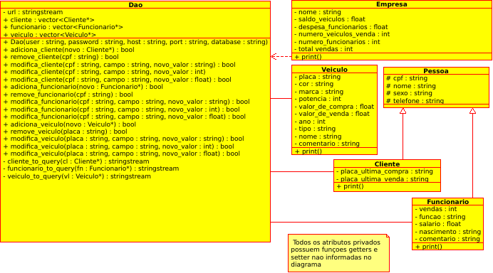

Relação entre classes
=====================

### Herança entre classes:
As classes `Funcionario` e `Cliente` herdam a classe `Pessoa`

### Agregação
A classe `Dao` (Data Access Object) agrega as outras classes `Cliente` `Funcionario` e `Veiculo` pois possui atributos que são dessas classes

A classe Empresa também precisa de um objeto Dao para seu construtor

É possível observar essas ligações no diagrama de classes a seguir:

O arquivo UML.xmi pode ser aberto pelo aplicativo Umbrello.

