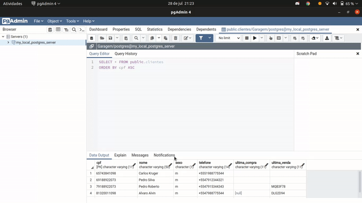
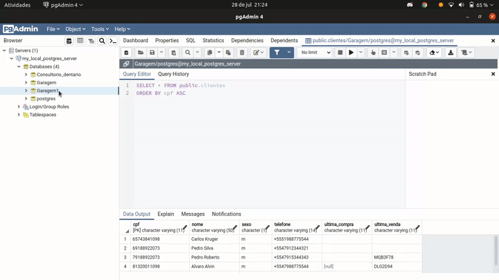

Gerenciador de garagens
=======================

### Requisitors

**Conector de C++ pqxx para o postgreSQL:**

Repositório disponível em:
https://github.com/jtv/libpqxx/tree/7.5.2

O convetor pqxx também pode ser instalado de forma mais simples via apt com os seguintes comandos:

    $ sudo apt-get update -y
    $ sudo apt-get install -y libpqxx-dev

**Biblioteca Grafica**

A biblioteca gráfica GTK4 v4.3+ está disponivel para download em:
https://download.gnome.org/sources/gtk/4.3/

Também instalado via apt:

    $ sudo apt-get update
    $ sudo apt-get install libgtk-4-dev

**Banco de da dados**

Foi utilizado o um banco de dados em PostgreSQL

A configuração do banco de dados foi realizada pelo PG Admin 4 
que também pode ser instalado via apt

    $ sudo apt install pgadmin4

Para configurar o banco de dados em sua máquina a melhor forma é por meio do arquivo de backup compactado disponibilizado `GaragemDB` 

Para fazer isso vá a seu PG Admin 4 e acesse seu servidor.

Em seguida crie uma nova DataBase

Então restore o database a partir do arquivo `GaragemDB`

### Antes de Compilar:
No arquivo `src/global.cpp` os campos devem ser substituidos para se adequarem ao banco de dados criado em sua máquina

Exemplo:

    Dao* dao = new Dao("SEU_USUARIO", "SUA_SENHA", "SEU_HOST", "SUA_PORTA", "SEU_DATABASE");

Deverá virar algo parecido com:

    Dao* dao = new Dao("postgres", "12345", "localhost", "5432", "Garagem1");

### Compilando:
Acesso o diretorio `/srs` e utilize o makefile digitando

    make all

Isso ira gerar um executavel com o nome de Gerenciador de garagem

#### PS:
As funções de mostrar, adicionar e modificar os veiculos funcionarios e clientes são executadas pelo terminal, logo é preciso abrir o aplicativo por ele acessando o diretorio do executavel:

    ./Gerenciador_de_garagem

